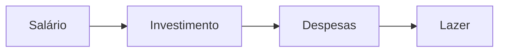

---
layout:
  title:
    visible: true
  description:
    visible: false
  tableOfContents:
    visible: true
  outline:
    visible: true
  pagination:
    visible: true
---

# O Homem Mais Rico da Babilônia

* Autor: George S. Clason
* Tradução: Luiz Cavalcantei de M. Guerra
* Harper Collins
* \#financeiro #livro #resumo

### Sobre

George Samuel Clason nasceu em Louisiana, Missouri, em 7 de novembro de 1874. Em 1926, lançou o primeiro de uma série de planfletos sobre economia e sucesso financeiro, usando parábolas ambientadas na antiga Babilônia para ilustrar suas lições, sendo _O Homem mais rico da Babilônia_ a mais famosa delas.

O livro não trata de enriquecimento rápido, longe disso. Ele oferece conselhos para atingir grandes objetivod tendo poucos recursos em mãos e disciplina.

### Início

O parábola começa com uma conversa entre Bansir, um fabricante de carruagens, e seu melhor amigo, o músico Kobbi. Em um certo dia, Kobbi encontra Basir desanimado e disperso em sua oficina, e acha estranho o amigo estar assim, uma vez que sempre foi muito focado e dedicado ao trabalho. Em resposta, Basir explica que na noite anterior teve um sonho onde era rico, e ao despertar, percebeu que o que o dinheiro que ganhava com sua oficina garantia apenas o sustento seu e de sua esposa, não tendo recursos nem mesmo para comprar um presente para ela.

Após ouvir o relato do amigo, Kobbi também percebe que esta em uma situação ainda pior, pois precisa fazer outros serviços além de seu trabalho como músico para conseguir se manter.

Ao buscarem uma solução para o problema de renda de ambos, Bansir se lembra de uma amigo de infância de ambos chamado Arkad. Assim como eles, Arkad foi uma criança de origem humilde porém, agora adulto, era o homem mais rico da Babilônia, emprestando dinheiro até mesmo para o rei. Intrigados com essa evolução de Arkad, os amigos decidem ir até a casa de Arkad buscar alguns conselhos em relação as suas finanças. É onde a história começa.

### Pague-se primeiro

> "Uma parte de todos os seus ganhos pertençe exclusivamente a você."

A primeira lição de Arkad, diz respeito a separar, no mínimo, a décima parte de toda renda que recebermos. Em outras palavras, pagar-se primeiro.

As pessoas normalmente seguem o seguinte fluxo quando recebem seu salário:

Após pagar os outros, a pessoa guarda para si o que restou (se restou algo). Arkad aconselha que devemos nos pagar primeiro, e após isso, utilizar o restante para o pagamento de despesas e lazer.

Pagar-se primeiro, e utilizar o restante do salário para as despesas nos ajuda a criar disciplina para viver com menos do que podemos ganhar e a identificar se estamos vivendo um padrão de vida mais alto do que nossa renda permite.

A decima parte é o ideal a ser poupada, mesmo em situações onde recebemos pouco dinheiro. A proporção pode ser maior de acordo com os ganhos e gastos de cada pessoal, entretando a regra aqui é sempre pagar-se primeiro.

Arkad também chama a atenção para o exagero nos gastos e também em tentar economizar demais. Se mesmo analisando nossas despesas, a décima parte do salário for tudo o que conseguimos poupar, devemos nos contentar com isso. Devemos fazer bom uso do dinheiro que recebemos e aproveitar a vida com nossa familia e amigos.

Encerrando esse assunto, Arkad aconselha que não devemos investir em áreas que não conhecemos ou deixar nosso dinheiro nas mãos de pessoas inexperientes no assunto (baseando-se na própria experiências e erros que cometeu durante o inicio de sua vida financeira). Sempre devemos buscar os conselhos de especialistar e investir em projetos que seja seguros e tenham garantia de retorno, evitando assim "aventuras" com investimentos.

### Sete soluções para a falta de dinheiro

O livro continua nos levando a um determinado dia, onde o rei Sargon e seu canceler discutima um problema econômico que afligia o reino. Em meio a conversa, o rei percebeu a diferença na distribuição de renda entre os cidadãos do reino, destacando que uma mínima parte do povo detinha uma grande quantidade de dinheiro, entre esses estava Arkad.

De modo a esclarecer o motivo de alguns se enriquecerem tanto enquanto outros continuam pobres, o reu decidiu chamar Arkad e pedir-lhe que ensinasse a um grupo de pessoas os passos para manusear o dinheiro de forma correta. Arkad então separa sua aula em sete soluções.

#### Primeira solução: poupe 10%

> Poupe no mínimo a décima parte do seus rendimentos

A primeira solução é mesma vista anteriormente, na coversa entre Arkad e seus amigos. Qualquer que seja a soma de dinheiro que recebamos, não devemos gastar mais do que a nona parte. Arkad salienta que, enquanto a nota parte serve para realizar os desejos e necessidades que temos no presente, a décima parte de ser poupada visando os desejos e objetivos que desejamos realizar no futuro.

> "Em cada dez moedas conseguidas de qualquer fonte, não gastem mais do que nove."

#### Segunda solução: faça um orçamento

> "Controle seus gastos"

A segunda solução consiste na criação de um orçamento e da anotação das despesas. Arkad chama a atenção da importância de criarmos um orçamento e segui-lo a risca, sem tocar em hipotese alguma na décima parte que guardamos.

O orçamento nos ajuda a ver gastos que a principio parecem essenciais, mas que com uma segunda analise não são. Arkad salienta que devemos sempre anotar nossos gastos pois a tendência é que cresçam de acoo com o nosso rendimento. Ter o orçamento em mãos e as despesas anotadas facilita em muito essa tarefa.

#### Terceira solução: multiplique seus rendimentos

> "Por cada moeda para trabalhar de modo que possa reproduzir-se como algodão nos campos e trazer-lhes lucro, um rio de riquezas fluindo constantemente para dentro de suas bolsas."

Embora poupar a décima parte e ver essa soma crescer, Arkad acrescenta que o idela aqui não é somente poupar, mas também colocar esse dinheiro para "trabalhar" por nós. Deve-se investir não somente o montante poupado, mas também os lucros gerados por esse investimento, de modo que o próprio dinheiro acabe nos trazendo mais dinheiro, multiplicando nossos rendimentos.

#### Quarta solução: proteja seu tesouro contra perdas

> "Protejam seu dinheiro contra perdas, investindo onde o principal esteja a salvo, onde possa ser reinvidicado sempre que o desejarem e onde fique claro para vocês que vão realmente conseguir uma bela renda. Consultem homens experimentados. Sigam a opinião daqueles que lidam habitualmente com dinheiro..."

Esta lição serve como um complemento a anterior. Aqui Arkad fala sobre a importância de investirmos com sabedoria, em investimentos que sejam seguros e tenha garantia de retorno, evitando aventuras com o investimento. Ele também aconselha a sempre buscar o conselho de especialistas de modo a aprender mais e validar se o investimento é um bom negócio ou não.

#### Quinta solução: faça do lar um investimento lucrativo

> "Tenha o seu próprio lar"

A quinta solução aborda a questão da casa própria. Embora nos dias atuais este seja um assunto que divide opiniões, o conselho de Arkad visa a segurança de possuir uma casa para chamar de sua e garantir um teto sobre você e sua familia. Ele também destaca a questão de passar anos pagando o aluguel ao invés de pagar as prestações de uma casa própria.

#### Sexta solução: assegurem um renda para o futuro

> "Seja previdente quanto às necessidades de sua velhice e quanto à proteção de sua família."

O próximo assunto não poderia ficar de fora: aposentadoria. Arkad levanta a importância de gerenciarmos nossos rendimentos também pensando no futuro, quando não estivermos mais em uma idade avançada ou mesmo quando falecermos, garantindo que nossa familia não fique desamparada.

#### Sétima solução: aumente sua capacidade para ganhar

> "... cultivar as suas próprias aptidões, estudar e somar conhecimentos, tornar-se mais habilidoso e agir sempre respeitando a si mesmo."

Por último, mas não menos importante. A sétima solução foca no aprimoramento pessoal e profissional. Arkad salienta que sempre devemos investir em adquirir novos conhecimentos e refinar nossas habilidades, principalmente no campo profissional, onde, conforme vamos ganhando experiência, podemos também ter acesso a trabalhos com maiores rendimentos. Isso também evita que possamos perder oportunidades interessante por falta de preparo.
